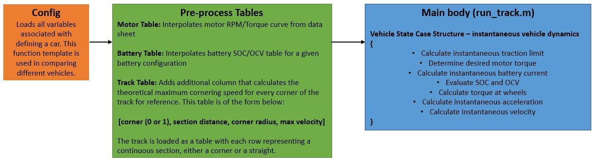

# PER Lapsim

## Todo

- [X] Generic track simulation

## General Structure

The main body of the simulation is called run_track.m, running this file should fully run the simulation. All static vehicle characteristics are given as a list of variables in config.m. The provided template is intended to be filled in with new values for a different car to be compared. These values may change throughout the simulation if necessary, but all values represent the vehicle stopped with the load of a driver. Some variables may need to be added to this file as the simulation matures, but only if they represent defining characteristics of the car. With these variables loaded, the simulation interpolates RPM-Torque curve for the motor and the SOC-OCV curve for the battery. These are simplistic models and should be improved upon within the projects described below.

The config.m file also loads the track for a desired simulation. Only one should be uncommented in this file when running the simulation. There are track files for all dynamic events called acceleration_run.m, autox.m, skidpad.m, and endurance.m. The tracks are tables of three columns with each row representing a new section of the track, either a straight or a corner. The first column is a Boolean value with 1 representing a corner, and 0 representing a straight section. The second column gives the section distance or arclength in meters, how far the car must travel. The third column is the corner radius in meters, this value is zero for straight sections. The track table pre-process adds a fourth column with the maximum attainable cornering velocity given vehicle characteristics. This function should be updated to consider the lateral tire force model and ensure the car neither understeers nor oversteers.

The simulation may need to be ran on a Purdue computer to access all additional MATLAB packages that are used. I would suggest using remote connect to port into a Purdue computer or using MATLAB as a remote connection.

## Modifying the Sim

Since multiple people are doing work on the sim at the same time, the use of GitHub has been established to provide a proper workflow for each individual. If a derivative work or spin off needs to be established, a branch is to be made for all commited changes. Work that needs to go into the core of the simulator should be initially commited into a branch with a pull request being made to merge with master when the changes have been reviewed and verified. If a bug is found or a new feature is needed, please use the integrated change requests templates on GitHub for the project. We are using GitHub to foster modification in a safe manner, so please, do edit!

## Projects

### Motor Model

Motor curves from data sheets are interpolated using specific data points input in config.m and the function process_motor_table.m. Motor dynamics are determined in motor.m. This function is a simple case structure that calculates motor torque from an input motor RPM assuming always operating at the power limit. The function limits the wheels from slipping at the calculated traction limit, this will require interaction with the traction project. The function should be updated to multiple motor systems. No analysis is currently done on motor cooling effects on performance.

### Battery Model

Battery characteristics are interpolated using process_battery_table.m and a data array of battery open circuit voltage (OCV) and state of charge (SOC) as with other characteristics are located in config.m. Battery dynamics are determined within battery.m. Changes should be made directly to these files. Notes from the original creator of the LapSim state that regen, low voltage load, and thermals for the battery are topics to add to the simulation. From my current understanding of the model, the OCV-SOC curve is fitted to experimental data. There are more accurate ways to model battery performance, but with the linearized SOC curve, a proper series RC model isn't really neccessary.

### Suspension Model

The current suspension model is extremely basic. There is a half-baked attempt at weight transfer coded in longitudinal_traction.m however there are not detailed characteristics of the suspension in the Config template. Thinking hub-motors, it would be extremely beneficial to include suspension characteristics in evaluating its performance. Additionally, including the tire model in the simulation will require inputs of each individual wheel normal force and camber angle. I have started a script with some basic suspension calculations called weight_transfer.m. In this file I have included some critical suspensions lengths that should be included in the Config. I will leave this project to be open ended as far as how detailed the results should be, so as if the instantaneous normal force and camber of each wheel is included. For the time being, start these calculations in a new script.

### Traction

Wheel slip dynamics may be somewhat difficult to properly simulate. The current motor dynamics in motor.m assumes that the car is always operating at the power limit and will further limit output torque to the traction limit if necessary. The traction limit can be updated using the tire model simulation directly in longitudinal_traction.m and the track table preprocessing. I have created two functions called magic_formula_corner.m and magic_formula_straight.m that determines Pacejka tire coefficients for the lateral and longitudinal traction cases. The magic_formula.m function will evaluate either tractive force of an individual wheel with input of the respective coefficients, wheel normal load, and wheel camber angle. This project will be associated with updating the motor model as the slipping case is highly interrelated.